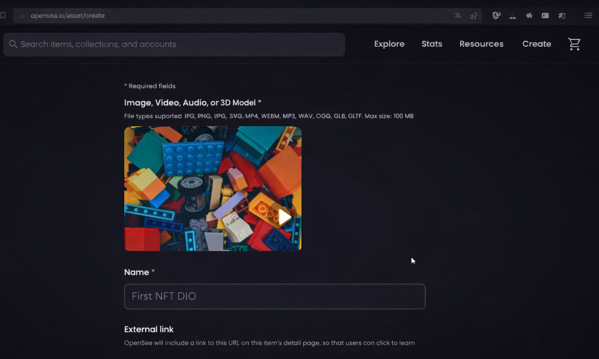
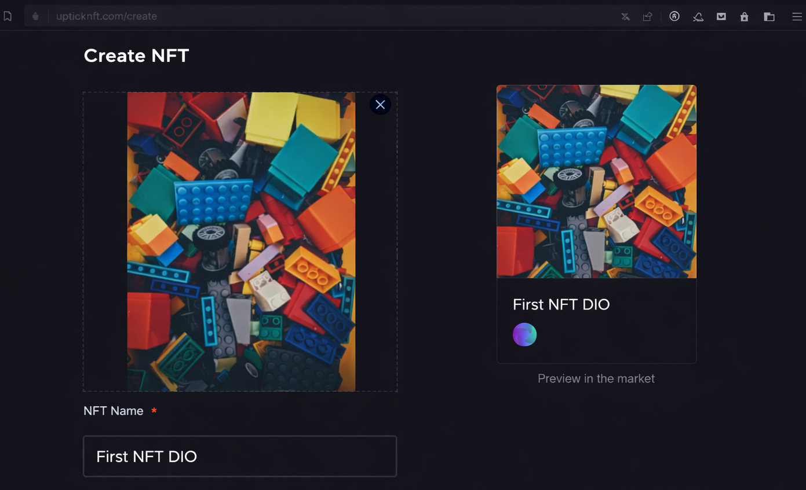

# Creating an NFT in Practice

Project developed at the Bootcamp Blockchain Specialist Training, under the guidance of specialist [Ricardo Zago](https://www.linkedin.com/in/ricardozago/ "Ricardo Zago").
Learning how to create a Non-Fungible Token, the famous NFT, on the free blockchains OpenSea Polygon and Uptick.

Technologies used:

- OpenSea Polygon
- Uptick

Useful links:

- [OpenSea Polygon](https://www.uptick.network/)

- [Uptick](https://opensea.io/)

Send the NFT to the Instructor's Wallet:

OpenSea – Polygon

0xA9155F5B6FC993A82346a8ff86EFEf513fc4c096

Uptick

iaa1ld2ck02x0909lg5tkqwdkfnsnsz7mmg6952jar

[LICENSE](/LICENSE)
